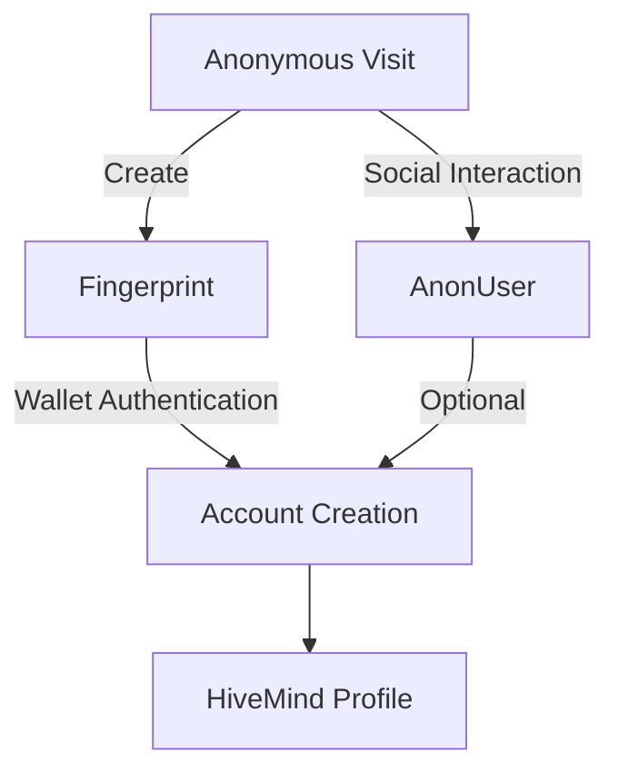
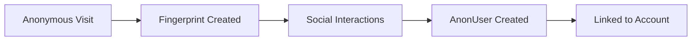
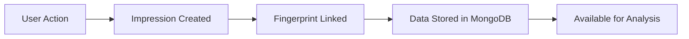
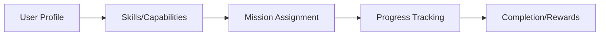
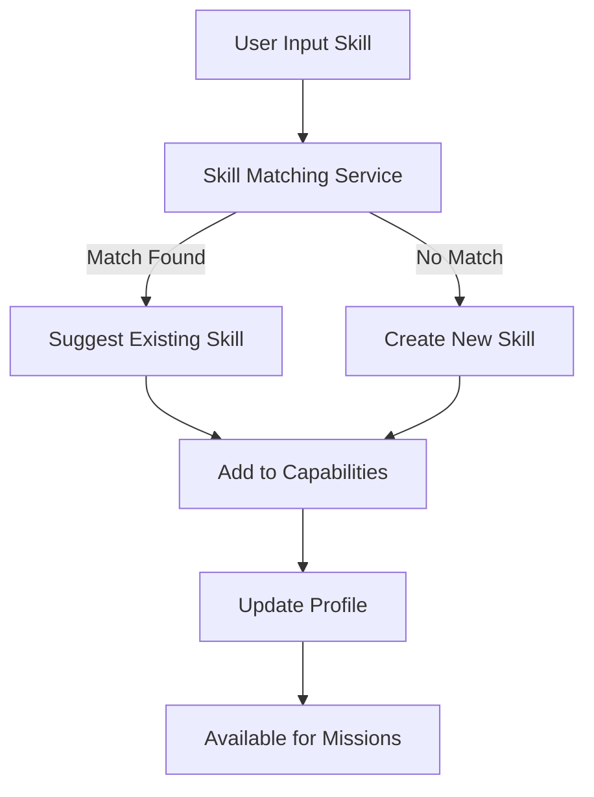
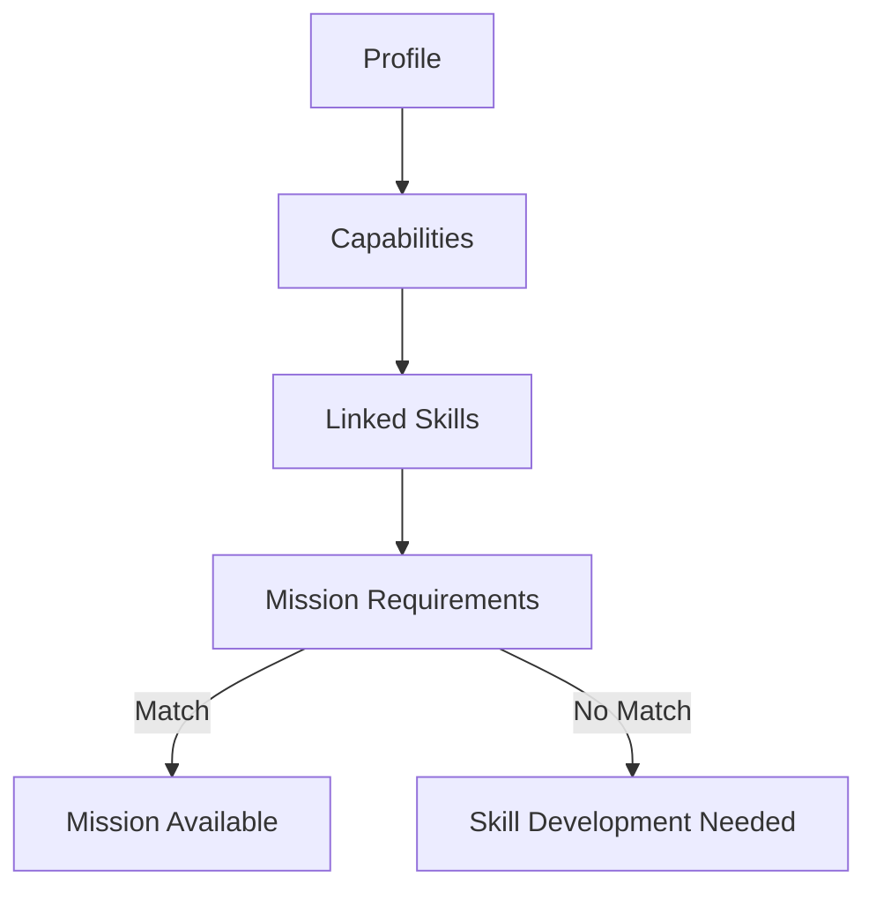

# Argos Server Architecture

## Core Systems

### 1. User Tracking & Identity
#### Fingerprinting System
- **Base Anonymous Users**
  - Managed through `fingerprint` service
  - Creates and maintains anonymous user identities
  - Serves as the foundation for linking all user interactions
  - Used across other services to maintain user context

#### Account System
- **Phantom Wallet Integration**
  - Primary authentication method
  - Links anonymous fingerprints to verified identities
  - Enables HiveMind participation
  - Manages wallet-based authorization

#### Anonymous Social Users
- **Social Identity Bridge**
  - Stored as `anonUsers` in MongoDB
  - Used in mini-games and social interactions
  - Can be linked to permanent fingerprint records via account creation
  - Enables progressive identity revelation

#### Identity Flow


#### Real-time Tracking
- **Visit Tracking**
  - Monitors user presence on sites
  - Real-time user activity tracking
  - Session management
  
- **Presence Service**
  - Real-time user state management
  - Active user status tracking
  - Site engagement metrics

### 2. User Interaction Capture
#### Impressions System
- **Generic Data Capture**
  - Captures arbitrary interaction data
  - Examples:
    - Form submissions
    - Q&A responses
    - User choices
  - Linked to fingerprint IDs for user context
  - Flexible schema for various data types

### 3. Game Systems
#### HiveMind Mission Board
- **Core Components**
  - **Profile Service**
    - User progression tracking
    - Personal stats and metrics
    - Central user identity for HiveMind
    - Connects capabilities and skills
  
  - **Skill System**
    - **Dynamic Skill Management**
      - Natural language skill input
      - Semantic matching of similar skills
      - Automatic skill grouping and refinement
      - Growing skill taxonomy
    
    - **Skill Matching Service**
      - Processes natural language skill descriptions
      - Suggests existing matching skills
      - Creates new skills when unique
      - Helps maintain skill consistency
    
    - **Capability Service**
      - Links profiles to validated skills
      - Manages user's proven abilities
      - Tracks skill proficiency levels
      - Connects skills to mission requirements
    
    - **Stats Service**
      - Tracks user performance metrics
      - Monitors skill usage and growth
      - Provides progression insights
      - Supports profile development

  - **Mission Service**
    - Task creation and management
    - Progress tracking
    - Skill requirement matching
    - Reward distribution

#### Tag System
- **Mini-game Implementation**
  - Uses anonUsers for social interactions
  - Example of social identity integration

### 4. Agent System
- **Agent Management**
  - Agent registration and activation
  - Capability-based permissions
  - Agent verification and security
  - Mission assignment and execution
  
- **Knowledge Management**
  - Knowledge creation and storage
  - Compression and decompression
  - Knowledge sharing between agents
  - Knowledge transfer and ownership management

### 5. Experimental Features
#### Reality Stability Index
- **Narrative Game Mechanic**
  - Calculates "matrix anomalies"
  - Tied to Project89 price movements
  - Creates dynamic narrative opportunities
  - Gamifies market activity

#### Price Integration
- **Market Connection**
  - Experimental price tracking
  - Used for reality stability calculations
  - Development and agent testing platform

### 6. Administration
#### Role System
- **Access Control**
  - Admin-only functionality
  - Role-based permissions
  - Access control for sensitive operations
  - Agent rank management

## Data Flow Examples

### User Identity Flow


### Interaction Capture Flow


### Mission System Flow


## MongoDB Integration

### Collections Structure
- **User Identity**
  - `fingerprints`: Anonymous user tracking
  - `accounts`: Wallet-linked accounts
  - `anonUsers`: Social identities
  
- **Game Systems**
  - `profiles`: User profiles
  - `capabilities`: User skills
  - `missions`: User tasks
  - `stats`: User performance metrics
  
- **Agent System**
  - `agents`: AI agents
  - `agentInvites`: Invitations
  - `knowledge`: Agent knowledge base
  - `knowledgeShares`: Shared knowledge

### Data Access Patterns
- **Safe Filters**
  - Use `idFilter` utility for MongoDB ObjectId handling
  - Validate filters before database operations
  - Error handling for invalid ObjectIds
  
- **Transactions**
  - MongoDB sessions for data consistency
  - Transaction utilities for multi-document operations
  - Proper error handling and rollback

### Timestamp Handling
- Native JavaScript `Date` objects for timestamps
- Utility functions for timestamp conversion and comparison
- Consistent timestamp handling across services

## Integration Points

1. **Frontend Integration**
   - Fingerprinting for user tracking
   - Real-time presence monitoring
   - Mission board interface
   - Reality stability display

2. **External Systems**
   - Market data integration
   - Social platform connections
   - Analytics and monitoring

3. **Game Logic**
   - Mission progression
   - Reality stability calculations
   - User achievement tracking

## Security Considerations

1. **User Privacy**
   - Anonymous base fingerprinting
   - Optional identity linking
   - Data segregation

2. **Data Protection**
   - Secure impression storage
   - Protected user profiles
   - Controlled access to admin functions

3. **⚠️ Privacy Implications**
   - **Identity Linking**: The system can potentially link social identities to wallet addresses
   - **User Consent**: Implementation should require explicit user consent for identity linking
   - **Data Minimization**: Only store necessary linking data
   - **Right to be Forgotten**: Implement mechanisms to unlink/delete identity connections
   - **Transparency**: Make users aware of how their identities are linked
   - **Implementation Guidance**:
     ```typescript
     // Example: Implementing user consent
     interface CreateAccountRequest {
       walletAddress: string;
       fingerprintId?: string;
       anonUserId?: string; // Previously transitoryFingerprintId
       userConsent: {
         identityLinking: boolean;
         dataRetention: boolean;
         timestamp: Date;
       };
     }
     ```

## Future Expansion Areas

1. **Enhanced Game Mechanics**
   - Expanded reality stability features
   - Advanced mission systems
   - More mini-game integrations

2. **Identity Management**
   - Additional social platform integration
   - Enhanced fingerprint linking
   - Progressive identity revelation

3. **Analytics and Insights**
   - Advanced user tracking
   - Behavior analysis
   - Game progression metrics 

#### Example Flows


