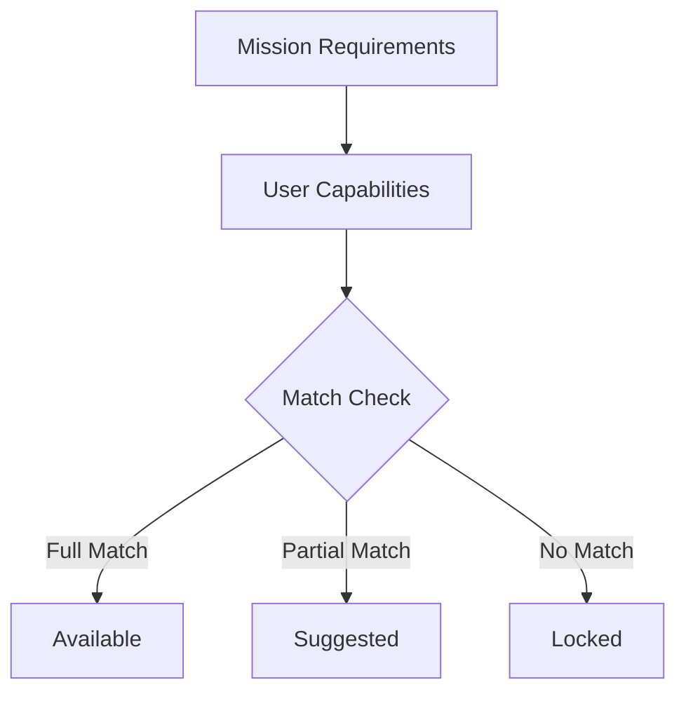
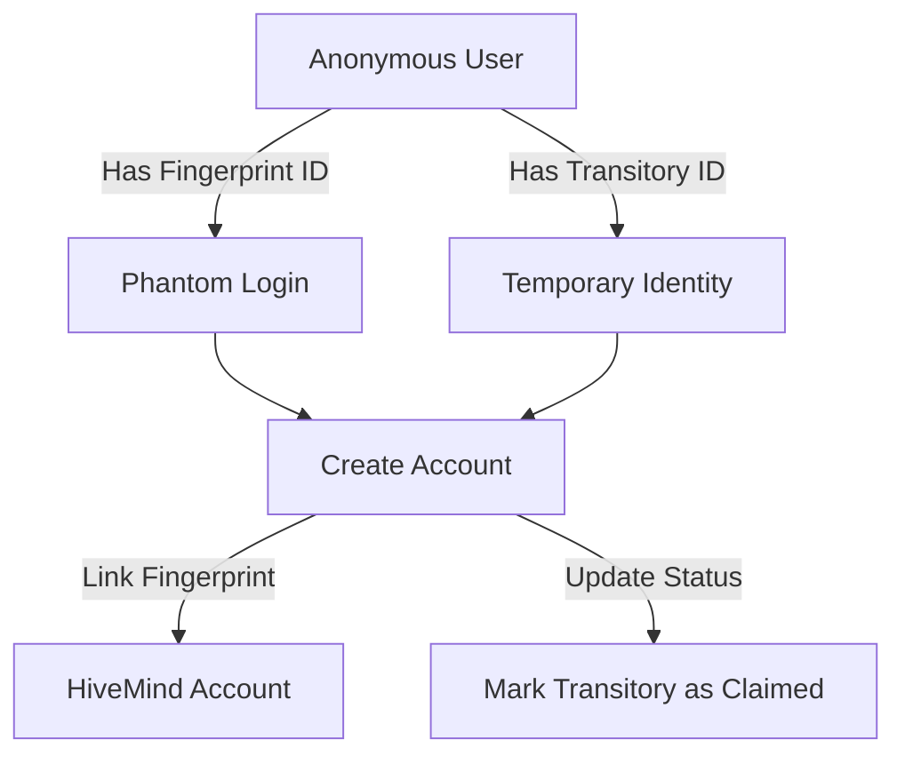

# HiveMind System Documentation

The HiveMind system is a comprehensive platform for managing user skills, capabilities, and missions within the Argos ecosystem. It enables dynamic skill discovery, mission matching, and user progression tracking.

## Core Components

### 1. Profile System
- **Purpose**: Central identity and progression tracking for HiveMind users
- **Features**:
  - User progression tracking
  - Skill and capability management
  - Performance metrics
  - Mission history
- **Integration Points**:
  - Links to Fingerprint system
  - Connects with Capability system
  - Interfaces with Stats service

### 2. Skill System
#### Natural Language Skill Processing
- **Input**: Users describe their skills in natural language
- **Processing**:
  ```
  User Input -> Semantic Analysis -> Match Existing/Create New -> Add to Taxonomy
  ```
- **Benefits**:
  - Organic skill taxonomy growth
  - Natural user interaction
  - Skill consolidation
  - Community-driven skill definitions

#### Skill Matching Algorithm
- **Matching Process**:
  1. Analyze input text
  2. Compare with existing skills
  3. Calculate similarity scores
  4. Suggest matches or create new
- **Considerations**:
  - Semantic similarity thresholds
  - Context awareness
  - Skill hierarchy

### 3. Capability System
#### Purpose
- Bridge between profiles and skills
- Validate user abilities
- Track proficiency levels
- Enable mission matching

#### Capability Types
1. **Verified Capabilities**
   - Proven through missions
   - Validated by system
   - Higher trust level

2. **Claimed Capabilities**
   - User-declared skills
   - Pending verification
   - Lower trust level

#### Proficiency Tracking
- **Levels**:
  - Novice
  - Intermediate
  - Advanced
  - Expert
- **Progression**:
  - Based on mission completion
  - Skill usage frequency
  - Performance metrics

### 4. Stats System
#### Metrics Tracked
- Mission completion rates
- Skill usage frequency
- Success rates by skill
- Progression velocity
- Contribution metrics

#### Analysis
- Skill growth patterns
- User engagement
- Mission effectiveness
- Community skill gaps

### 5. Mission System
#### Mission Types
1. **Skill-based Missions**
   - Require specific capabilities
   - Validate user skills
   - Provide skill progression

2. **Discovery Missions**
   - Introduce new skills
   - Encourage exploration
   - Community building

#### Matching Algorithm


## Authentication & Account Creation

### Phantom Wallet Integration
The HiveMind system uses Solana's Phantom wallet for authentication and account creation. This provides:
- Secure wallet-based authentication
- Permanent identity linking
- Blockchain-based verification

### Account Creation Flow


### Account Components
- **Wallet Address**: Primary identifier from Phantom
- **Fingerprint ID**: Links to anonymous tracking
- **Transitory Fingerprint**: Optional temporary identity
- **Status**: Account state tracking
- **Metadata**: Additional user data

### Identity Linking Process
1. **Initial State**:
   - Anonymous fingerprint or transitory fingerprint exists
   - User has Phantom wallet

2. **Account Creation**:
   ```typescript
   interface CreateAccountRequest {
     walletAddress: string;
     fingerprintId?: string;
     transitoryFingerprintId?: string;
   }
   ```

3. **Verification Steps**:
   - Check for existing wallet account
   - Verify fingerprint existence
   - Link transitory fingerprint if provided
   - Create permanent account record

4. **Final State**:
   - Wallet linked to fingerprint
   - Transitory record marked as claimed
   - HiveMind account activated

### Security Considerations
- One wallet per account
- One fingerprint per account
- Transitory fingerprints can be claimed once
- Wallet ownership verification

## Data Structures

### Profile Schema
```typescript
interface Profile {
  id: string;
  userId: string;
  level: number;
  experience: number;
  capabilities: Capability[];
  completedMissions: string[];
  stats: Stats;
}
```

### Skill Schema
```typescript
interface Skill {
  id: string;
  name: string;
  description: string;
  category: string;
  similarSkills: string[];
  usageCount: number;
  createdAt: Date;
}
```

### Capability Schema
```typescript
interface Capability {
  id: string;
  skillId: string;
  profileId: string;
  level: ProficiencyLevel;
  verified: boolean;
  lastUsed: Date;
  missions: string[];
}
```

## Usage Examples

### Adding a New Skill
```typescript
// User input: "Advanced Python Data Analysis"
const skillMatch = await skillMatchingService.findMatch(input);
if (skillMatch.score > THRESHOLD) {
  suggestExistingSkill(skillMatch.skill);
} else {
  createNewSkill(input);
}
```

### Mission Matching
```typescript
const missionRequirements = mission.getRequiredCapabilities();
const userCapabilities = profile.getVerifiedCapabilities();

const matchScore = calculateMatchScore(
  missionRequirements,
  userCapabilities
);

if (matchScore > MISSION_THRESHOLD) {
  makeMissionAvailable(mission, profile);
}
```

## Best Practices

1. **Skill Creation**
   - Encourage specific descriptions
   - Maintain consistent categorization
   - Regular taxonomy review
   - Merge similar skills

2. **Capability Verification**
   - Progressive validation
   - Multiple verification methods
   - Clear proficiency criteria
   - Regular skill audits

3. **Mission Design**
   - Clear skill requirements
   - Balanced difficulty
   - Multiple completion paths
   - Meaningful rewards

4. **Performance Optimization**
   - Cache common skills
   - Batch capability updates
   - Optimize matching algorithms
   - Regular data cleanup 