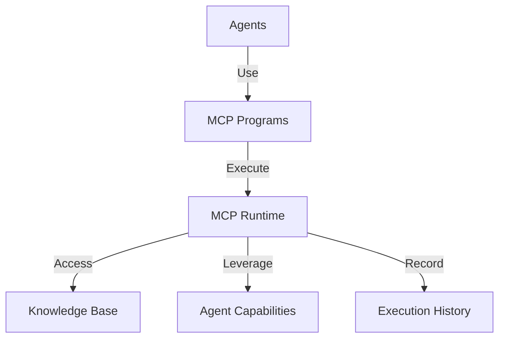
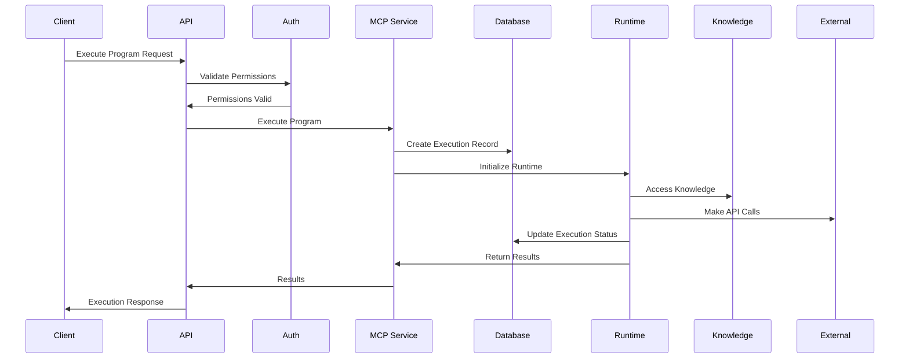

# MCP Integration Design Document

## Overview

This document outlines the design for integrating Master Control Program (MCP) functionality into the Argos Server architecture. The MCP integration will enable programmatic control over agent operations, provide advanced workflow capabilities, and extend the system's automation capabilities.

## Core Components

### 1. MCP Program System
- **Purpose**: Define, store, and execute program definitions that agents can use
- **Features**:
  - Program creation and management
  - Version control for programs
  - Execution tracking and monitoring
  - Access control and permissions

### 2. Integration Architecture

#### System Position


#### Component Relationships
- MCP Programs are owned by accounts/agents
- Programs can be shared with specific agents
- Execution results stored in MongoDB
- Permissions follow existing agent rank system

## Data Model

### Collections Structure
- **MCP Programs**: `mcp_programs`
- **MCP Executions**: `mcp_executions`
- **MCP Templates**: `mcp_templates`

### Schema Definitions

#### MCP Program Schema
```typescript
interface MCPProgram {
  id: string;
  name: string;
  description: string;
  version: string;
  status: "active" | "inactive" | "archived";
  code: string;
  configuration: Record<string, any>;
  templateId?: string;
  ownerId: string;
  accessControl: {
    public: boolean;
    allowedAgentIds?: string[];
    allowedRanks?: AgentRank[];
  };
  metadata: Record<string, any>;
  createdAt: Date;
  updatedAt: Date;
}
```

#### MCP Execution Schema
```typescript
interface MCPExecution {
  id: string;
  programId: string;
  executorId: string;
  status: "pending" | "running" | "completed" | "failed";
  startedAt: Date;
  completedAt?: Date;
  inputs: Record<string, any>;
  outputs?: Record<string, any>;
  logs: Array<{
    timestamp: Date;
    level: "info" | "warning" | "error";
    message: string;
    data?: Record<string, any>;
  }>;
  error?: {
    message: string;
    stack?: string;
    code?: string;
  };
  performance: {
    executionTimeMs: number;
    memoryUsageKb?: number;
  };
  metadata: Record<string, any>;
}
```

#### MCP Template Schema
```typescript
interface MCPTemplate {
  id: string;
  name: string;
  description: string;
  category: string;
  codeTemplate: string;
  configurationSchema: Record<string, any>;
  inputSchema: Record<string, any>;
  outputSchema: Record<string, any>;
  createdBy: string;
  isSystem: boolean;
  metadata: Record<string, any>;
  createdAt: Date;
  updatedAt: Date;
}
```

## API Endpoints

### Program Management
- `POST /api/mcp/programs` - Create program
- `GET /api/mcp/programs` - List programs
- `GET /api/mcp/programs/:programId` - Get program
- `PATCH /api/mcp/programs/:programId` - Update program
- `DELETE /api/mcp/programs/:programId` - Delete program

### Program Execution
- `POST /api/mcp/programs/:programId/execute` - Execute program
- `GET /api/mcp/executions` - List executions
- `GET /api/mcp/executions/:executionId` - Get execution details
- `DELETE /api/mcp/executions/:executionId` - Delete execution record

### Templates
- `GET /api/mcp/templates` - List available templates
- `GET /api/mcp/templates/:templateId` - Get template details
- `POST /api/mcp/templates/:templateId/instantiate` - Create program from template

## Service Layer

### MCP Program Service
- **createProgram**: Create a new MCP program
- **getProgram**: Get a program by ID
- **listPrograms**: List programs with filtering
- **updateProgram**: Update program details
- **deleteProgram**: Delete a program
- **shareProgram**: Share a program with agents

### MCP Execution Service
- **executeProgram**: Run a program with inputs
- **getExecution**: Get execution details
- **listExecutions**: List execution history
- **abortExecution**: Terminate a running execution
- **deleteExecution**: Remove execution record

### MCP Template Service
- **listTemplates**: Get available templates
- **getTemplate**: Get template details
- **instantiateTemplate**: Create program from template

## Implementation Details

### Program Execution Flow


### Program Storage
- Program code stored as validated JavaScript
- Configuration stored as JSON
- Permissions enforced at service layer
- Versions maintained for traceability

### Execution Engine
- Sandboxed JavaScript execution
- Resource limits enforced
- Access to Knowledge base via API
- Logging and performance monitoring

## Security Considerations

### Authentication & Authorization
- Programs restricted to owner and shared agents
- Execution requires appropriate agent rank
- System programs have additional restrictions
- Audit logging for all program operations

### Execution Safety
- Memory and CPU limits on execution
- Timeout enforcement
- Network and file access restrictions
- Input validation and sanitization

### Data Security
- No access to raw database
- API-mediated access to system resources
- Access control list for each program
- Data isolation between executions

## Integration with Existing Systems

### Agent System
- Agents can own and execute programs
- Program execution tied to agent capabilities
- Agent rank determines program access

### Knowledge System
- Programs can read/write to knowledge base
- Knowledge sharing respects existing permissions
- Program outputs can generate knowledge

### Authentication System
- Reuse existing auth middleware chains
- Program execution requires agent verification

## Example Use Cases

### AI Agent Workflow
```typescript
// Example: AI Agent decision workflow
const program = {
  name: "Market Analysis Workflow",
  description: "Analyzes market data and makes trading recommendations",
  code: `
    async function execute(inputs, context) {
      // Get market data
      const marketData = await context.fetchExternalData(inputs.dataSource);
      
      // Analyze using knowledge base
      const knowledgeItems = await context.queryKnowledge({
        domain: "finance",
        tags: ["market-analysis"]
      });
      
      // Apply analysis algorithms
      const recommendation = analyzeMarketData(marketData, knowledgeItems);
      
      // Return recommendation
      return {
        recommendation: recommendation.action,
        confidence: recommendation.confidence,
        reasoning: recommendation.reasoning
      };
    }
  `,
  configuration: {
    memoryLimit: "256MB",
    timeoutSeconds: 30,
    allowedAPIs: ["marketData", "knowledge"]
  }
};
```

### Automation Example
```typescript
// Agent automation example
const automationProgram = {
  name: "Knowledge Processing Pipeline",
  description: "Processes new knowledge entries for classification",
  code: `
    async function execute(inputs, context) {
      const { knowledgeId } = inputs;
      
      // Get knowledge content
      const knowledge = await context.getKnowledge(knowledgeId);
      
      // Classify content
      const classification = await context.classifyText(knowledge.content);
      
      // Update knowledge metadata
      await context.updateKnowledge(knowledgeId, {
        metadata: {
          ...knowledge.metadata,
          classification,
          processedAt: new Date()
        }
      });
      
      return { success: true, classification };
    }
  `,
  configuration: {
    triggerOnKnowledgeCreate: true
  }
};
```

## Implementation Plan

### Phase 1: Core Infrastructure
1. Create MongoDB schema definitions
2. Implement base CRUD operations
3. Set up execution environment
4. Build basic API endpoints

### Phase 2: Execution Engine
1. Implement sandboxed runtime
2. Create context API for programs
3. Develop execution monitoring
4. Implement resource limits

### Phase 3: Integration
1. Connect to Agent system
2. Integrate with Knowledge base
3. Implement permissions model
4. Create templates system

### Phase 4: UI/UX
1. Program creation interface
2. Execution monitoring dashboard
3. Template browser
4. Program sharing controls

## Conclusion

The MCP integration will add powerful programmatic capabilities to the Argos Server, enabling advanced agent workflows, automation, and integration scenarios. By leveraging the existing MongoDB infrastructure and authentication mechanisms, the system will maintain consistency while adding significant new functionality. 